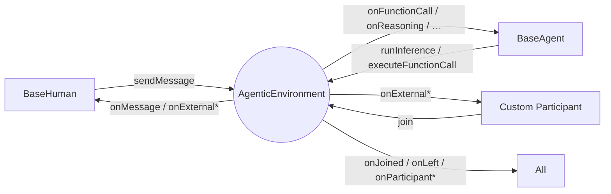
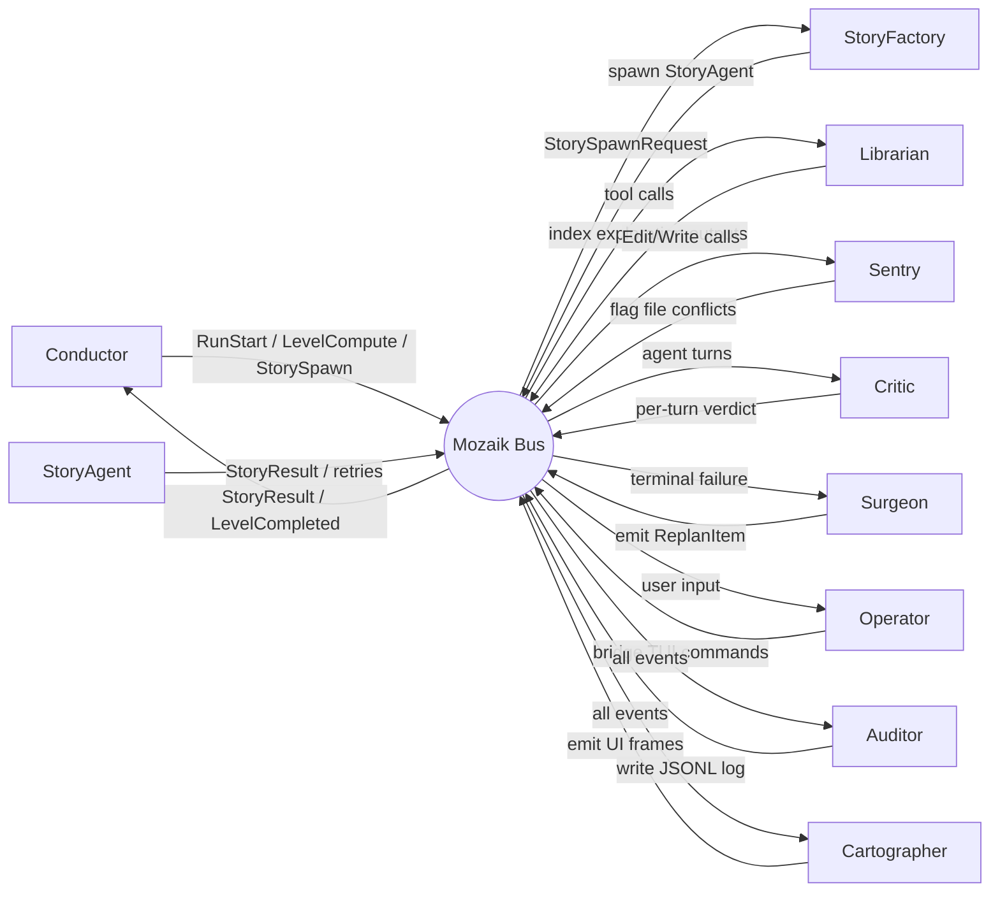

# Mozaik

**Mozaik** is TypeScript framework for building reactive agents. It provides the easiest way to build collaborative, **event-driven agents** that can work together in parallel.

  

In Mozaik, humans, agents, observers, and tools are all `Participant`s of the same `AgenticEnvironment`. Each participant runs **non-blocking** and produces events into the environment: plain-text **messages** for conversational input/output, and typed `ContextItem`s for model internals (function calls, function call outputs, reasoning, model messages). Every other participant sees those events in real time and can react, intercept, or stay silent — without any central scheduler.

---

## Installation

**npm**

```bash
npm install @mozaik-ai/core
```

**yarn**

```bash
yarn add @mozaik-ai/core
```

**pnpm**

```bash
pnpm add @mozaik-ai/core
```

## API Key Configuration

```env
# .env
OPENAI_API_KEY=your-openai-key-here
```

---

## The agentic environment

`AgenticEnvironment` is where everything happens. `Participant`s `join()` it, and from that moment on they can **listen to messages and events** flowing through the environment by overriding any of the handlers below:

| Handler                        | Triggered when…                                        |
| ------------------------------ | ------------------------------------------------------ |
| `onJoined`                     | this participant joins an environment                  |
| `onLeft`                       | this participant leaves an environment                 |
| `onParticipantJoined`          | another participant joins the same environment         |
| `onParticipantLeft`            | another participant leaves the same environment        |
| `onMessage`                    | any participant sends a message                        |
| `onFunctionCall`               | its own inference returns a function call              |
| `onExternalFunctionCall`       | another agent's inference returns a function call      |
| `onFunctionCallOutput`         | its own function call runner returns a result          |
| `onExternalFunctionCallOutput` | another agent's function call runner returns a result  |
| `onReasoning`                  | its own inference returns a reasoning item             |
| `onExternalReasoning`          | another agent's inference returns a reasoning item     |
| `onModelMessage`               | its own inference returns an assistant message         |
| `onExternalModelMessage`       | another agent's inference returns an assistant message |
| `onInternalEvent`              | its own inference emits a semantic stream event        |
| `onExternalEvent`              | another participant emits a semantic stream event      |

Every handler defaults to a no-op — override only the ones you care about.



---

## Non-blocking participants

Mozaik ships three ready-to-use participants:

| Participant    | Role                                                                             |
| -------------- | -------------------------------------------------------------------------------- |
| `BaseHuman`    | Sends messages with `sendMessage(environment, text)`                             |
| `BaseAgent`    | Runs inference and function calls via `InferenceRunner` and `FunctionCallRunner` |
| `BaseObserver` | Listens only; no inference                                                       |

```ts
import {
	AgenticEnvironment,
	BaseAgent,
	BaseHuman,
	OpenAIInferenceRunner,
	DefaultFunctionCallRunner,
	Gpt54Mini,
	ModelContext,
} from "@mozaik-ai/core"

const environment = new AgenticEnvironment()

const human = new BaseHuman()
const agent = new BaseAgent(new OpenAIInferenceRunner(), new DefaultFunctionCallRunner())
const observer = new BaseObserver()

human.join(environment)
agent.join(environment)
observer.join(environment)

environment.start()

human.sendMessage(environment, "Hello")
```

The environment fans every item out to every subscriber synchronously and without awaiting them, so a slow listener never blocks producers or other listeners.

---

## Reactive agent

A reactive agent extends `BaseAgent` and overrides the handlers it wants to react on. Each handler is already a no-op in the base class, so only the relevant ones need bodies:

```ts
import {
	BaseAgent,
	Participant,
	UserMessageItem,
	FunctionCallItem,
	FunctionCallOutputItem,
	ReasoningItem,
	ModelMessageItem,
	AgenticEnvironment,
	ModelContext,
	GenerativeModel,
	InferenceRunner,
	FunctionCallRunner,
} from "@mozaik-ai/core"

export class ReactiveAgent extends BaseAgent {
	constructor(
		inferenceRunner: InferenceRunner,
		functionCallRunner: FunctionCallRunner,
		private readonly environment: AgenticEnvironment,
		private readonly context: ModelContext,
		private readonly model: GenerativeModel,
	) {
		super(inferenceRunner, functionCallRunner)
	}

	// A message from a human (or any other participant) → record it and think.
	async onMessage(message: string): Promise<void> {
		this.context.addContextItem(UserMessageItem.create(message))
		this.runInference(this.environment, this.context, this.model)
	}

	// The agent just produced a function call → execute it.
	async onFunctionCall(item: FunctionCallItem): Promise<void> {
		this.context.addContextItem(item)
		this.executeFunctionCall(this.environment, item)
	}

	// The tool just produced an output → feed it back and run inference again.
	async onFunctionCallOutput(item: FunctionCallOutputItem): Promise<void> {
		this.context.addContextItem(item)
		this.runInference(this.environment, this.context, this.model)
	}

	// Keep the local context in sync with model-emitted reasoning and replies.
	async onReasoning(item: ReasoningItem): Promise<void> {
		this.context.addContextItem(item)
	}

	async onModelMessage(item: ModelMessageItem): Promise<void> {
		this.context.addContextItem(item)
	}
}
```

Three things to note:

1. The split between self handlers and `onExternal*` handlers means a participant can encode "act on my own outputs" separately from "observe others", without inspecting `source` by hand.
2. The agent never `await`s its own capability calls inside the handlers — those methods are non-blocking, so the environment keeps delivering events while inference and tool execution run in the background.
3. Behaviors compose by **reaction**, not orchestration. Add a second agent that overrides `onExternalModelMessage` and you get a critique loop. Add a `TranscriptLogger` and you get a UI stream. Neither change touches the existing participants.

---

## Streaming and semantic events

Enable streaming on a model that supports it, then run inference as usual:

```ts
const model = new Gpt54Mini()
model.setStreaming(true)

await agent.runInference(environment, context, model)
```

With streaming enabled, `OpenAIInferenceRunner` emits **`SemanticEvent`** chunks (provider `type` + `data`) into the environment. The producing agent receives `onInternalEvent`; everyone else receives `onExternalEvent(source, event)`. Use these handlers to drive a live UI—for example, print text deltas from `response.output_text.delta` events.

`setStreaming(true)` on a model without `supportStreaming` throws before the API is called.

---

## Lifecycle hooks

Every participant receives lifecycle notifications when it or others join/leave an environment:

```ts
export class TeamAgent extends BaseAgent {
	// Called when this participant joins an environment.
	onJoined(environment: AgenticEnvironment): void {
		console.log("I joined the environment")
	}

	// Called when this participant leaves an environment.
	onLeft(environment: AgenticEnvironment): void {
		console.log("I left the environment")
	}

	// Called when another participant joins the same environment.
	onParticipantJoined(participant: Participant, environment: AgenticEnvironment): void {
		console.log(`${participant.constructor.name} joined`)
	}

	// Called when another participant leaves the same environment.
	onParticipantLeft(participant: Participant, environment: AgenticEnvironment): void {
		console.log(`${participant.constructor.name} left`)
	}
}
```

This lets participants react to membership changes — for example, an agent could start inference only after a required collaborator has joined, or clean up shared state when someone leaves.

---

## Reacting to external events

Participants can listen to external events and react by overriding methods like `onMessage`, `onExternalFunctionCall`, `onExternalFunctionCallOutput`, `onExternalReasoning`, and `onExternalModelMessage`.

## Passive observer

You can create observers that don't run inference themselves but watch what's happening in the conversation and take side actions (logging, metrics, persistence, etc.). Subclass `Participant` and override only the handlers you care about:

```ts
import { Participant, FunctionCallItem, FunctionCallOutputItem, ReasoningItem, ModelMessageItem } from "@mozaik-ai/core"

export class TranscriptLogger extends Participant {
	async onMessage(message: string): Promise<void> {
		console.log("[message]", message)
	}

	async onExternalFunctionCall(source: Participant, item: FunctionCallItem): Promise<void> {
		console.log(`[${source.constructor.name}] function_call`, item.toJSON())
	}

	async onExternalFunctionCallOutput(source: Participant, item: FunctionCallOutputItem): Promise<void> {
		console.log(`[${source.constructor.name}] function_call_output`, item.toJSON())
	}

	async onExternalReasoning(source: Participant, item: ReasoningItem): Promise<void> {
		console.log(`[${source.constructor.name}] reasoning`, item.toJSON())
	}

	async onExternalModelMessage(source: Participant, item: ModelMessageItem): Promise<void> {
		console.log(`[${source.constructor.name}] model_message`, item.toJSON())
	}

	// Self-emitted handlers (onFunctionCall, onReasoning, …) can be no-ops for a pure observer.
	async onFunctionCall(): Promise<void> {}
	async onFunctionCallOutput(): Promise<void> {}
	async onReasoning(): Promise<void> {}
	async onModelMessage(): Promise<void> {}
}
```

---

## Context and models (reference)

`ModelContext` is the ordered list of `ContextItem`s a `GenerativeModel` is asked to reason over. It is constructed and mutated explicitly — typically inside a participant in response to delivered items.

```ts
import { ModelContext, DeveloperMessageItem, UserMessageItem, InMemoryModelContextRepository } from "@mozaik-ai/core"

const context = ModelContext.create("project-id")
	.addContextItem(DeveloperMessageItem.create("You are a helpful assistant."))
	.addContextItem(UserMessageItem.create("What is the capital of France?"))

const repo = new InMemoryModelContextRepository()
await repo.save(context)
```

Implement `ModelContextRepository` to plug in any storage backend.

The default inference path is `OpenAIInferenceRunner`, which maps `ModelContext` to the OpenAI Responses API and back into typed `ContextItem`s (and `SemanticEvent`s when streaming). Bundled models: `Gpt54`, `Gpt54Mini`, `Gpt54Nano`, `Gpt55`.

```ts
import { OpenAIInferenceRunner, DefaultFunctionCallRunner, Gpt54, ModelContext } from "@mozaik-ai/core"

const runner = new OpenAIInferenceRunner()
const context = ModelContext.create("demo")

for await (const item of runner.run(context, new Gpt54())) {
	// ReasoningItem | FunctionCallItem | ModelMessageItem | SemanticEvent
}
```

---

## Overriding Generators

Mozaik uses async generators for inference and function calls — that's what lets the system emit events incrementally so participants can react to them as they arrive. Swap any runner to change _how_ events are produced.

Humans send text with `sendMessage(environment, message)`; other participants receive it via `onMessage`.

### Custom `InferenceRunner`

An `InferenceRunner` can yield `ReasoningItem`, `FunctionCallItem`, `ModelMessageItem`, and `SemanticEvent` (when streaming).

```ts
import { InferenceRunner, ModelContext, GenerativeModel, OpenAIInferenceRunner } from "@mozaik-ai/core"

// Use the bundled runner, or implement InferenceRunner for another provider.
const runner: InferenceRunner = new OpenAIInferenceRunner()
```

### Custom `FunctionCallRunner`

A `FunctionCallRunner` can only produce `FunctionCallOutputItem`.

```ts
import { FunctionCallRunner, FunctionCallItem, FunctionCallOutputItem, Tool } from "@mozaik-ai/core"

export class ToolRegistryFunctionCallRunner implements FunctionCallRunner {
	constructor(private readonly tools: Tool[]) {}

	async *run(call: FunctionCallItem, signal?: AbortSignal): AsyncIterable<FunctionCallOutputItem> {
		const tool = this.tools.find((t) => t.name === call.name)
		if (!tool) throw new Error(`Unknown tool: ${call.name}`)

		const result = await tool.invoke(JSON.parse(call.args))
		yield FunctionCallOutputItem.create(call.callId, JSON.stringify(result))
	}
}
```

---

## Examples

Working examples are available here: [mozaik-examples](https://github.com/jigjoy-ai/mozaik-examples).

---

## Made with Mozaik

- **[baro](https://github.com/Lotus015/baro)** — a Claude agent orchestrator where ten specialized participants (planner, executors, reviewer, fixer, librarian, auditor, and more) work fully concurrently on the same goal, like a team collaborating in real time instead of a single agent doing everything alone.



---

## Contributing

Contributions are welcome. Please read the [Contributing Guidelines](./CONTRIBUTING.md) before opening an issue or pull request.

## Author & License

Created by the [JigJoy](https://jigjoy.io) team.  
Licensed under the MIT License.
