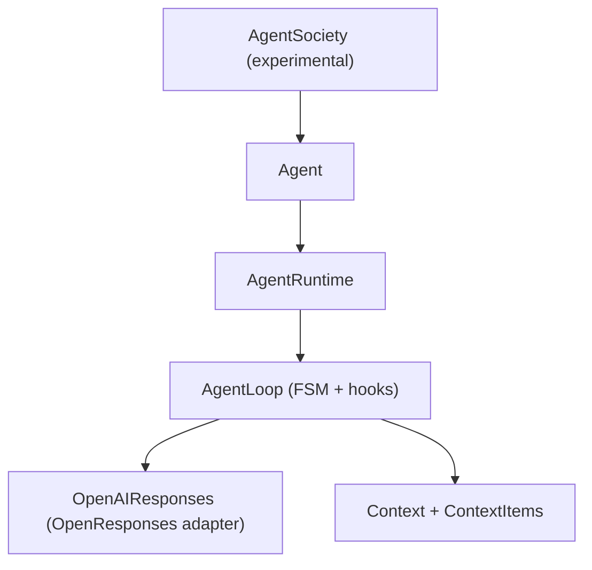
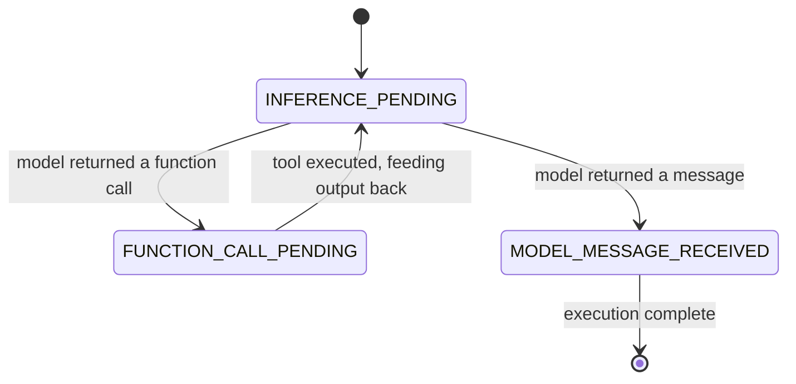

# Mozaik

**Mozaik** is a TypeScript framework for building non-blocking AI agents.

It provides a structured agent loop, a lifecycle hook system, a typed context model, and an experimental multi-agent runtime — giving you full control over how agents think, act, and collaborate.

---

## Installation

```bash
yarn add @mozaik-ai/core
```

## API Key Configuration

```env
# .env
OPENAI_API_KEY=your-openai-key-here
```

---

## Architecture

Mozaik is organized into four layers:



| Layer                   | Responsibility                                         |
| ----------------------- | ------------------------------------------------------ |
| **AgentSociety**        | Runs multiple agents concurrently (experimental)       |
| **Agent**               | Lifecycle callbacks, visitor hooks, high-level `run()` |
| **AgentRuntime**        | Drives the loop, dispatches hooks, manages errors      |
| **AgentLoop + Context** | FSM transitions and typed context model                |

---

## Core Concepts

### Agent Loop

The agent loop is a **finite state machine** that drives a multi-step inference cycle. Each execution moves through states until it reaches a terminal condition.



An `Execution` object tracks the current state, step count, transition history, and terminal status (`RUNNING`, `COMPLETED`, `FAILED`).

---

### Hooks (Events)

Every state transition exposes **before** and **after** hooks. You register callbacks on an `AgentRuntime` using `.on(hookId, callback)`:

```ts
import { AgentRuntime, HookId } from "@mozaik-ai/core"

const runtime = new AgentRuntime()

runtime.on(HookId.BEFORE_INFERENCE, async (context) => {
	console.log("About to call the model...")
})

runtime.on(HookId.AFTER_INFERENCE, async (context) => {
	console.log("Model responded:", context.inferenceResponse)
})

runtime.on(HookId.AFTER_FUNCTION_CALL, async (context) => {
	console.log("Tool executed:", context.functionCallOutput)
})

runtime.on(HookId.ON_ERROR, async (context) => {
	console.error("Agent failed:", context.error)
})
```

Available hooks:

| Hook                   | Fires                                |
| ---------------------- | ------------------------------------ |
| `BEFORE_INFERENCE`     | Before the model is called           |
| `AFTER_INFERENCE`      | After the model responds             |
| `BEFORE_FUNCTION_CALL` | Before a tool is invoked             |
| `AFTER_FUNCTION_CALL`  | After a tool returns                 |
| `BEFORE_MODEL_MESSAGE` | Before the final message is received |
| `AFTER_MODEL_MESSAGE`  | After the final message is received  |
| `ON_ERROR`             | When any state handler throws        |

---

### Agent

`Agent` wraps an `AgentRuntime` and pre-wires all hooks as overridable methods. Subclass it to customize behavior at any point in the lifecycle:

```ts
import { Agent, AgentRuntime, RuntimeContext } from "@mozaik-ai/core"

class MyAgent extends Agent {
	constructor() {
		super(new AgentRuntime())
	}

	async afterInference(context: RuntimeContext): Promise<void> {
		console.log("Tokens used:", context.inferenceResponse?.tokenUsage)
	}

	async onError(context: RuntimeContext): Promise<void> {
		console.error("Something went wrong:", context.error?.message)
	}
}

const agent = new MyAgent()
await agent.run("Summarize the latest news", model, context)
```

---

### InferenceVisitor

`InferenceVisitor` is a **visitor interface** that lets you observe the inference lifecycle without modifying the agent itself. Attach it to any `Agent` instance via `setInferenceVisitor`.

```ts
import { InferenceVisitor, InferenceResponse, RuntimeContext } from "@mozaik-ai/core"

class TelemetryVisitor implements InferenceVisitor {
	async onStart(context: RuntimeContext): Promise<void> {
		console.log("Agent started, execution:", context.execution.executionId)
	}

	async afterInference(response: InferenceResponse): Promise<void> {
		console.log("Inference complete, tokens:", response.tokenUsage)
	}
}

const agent = new MyAgent()
agent.setInferenceVisitor(new TelemetryVisitor())
```

Use `InferenceVisitor` for concerns that should stay separate from agent logic: logging, telemetry, streaming responses to a UI, or recording usage metrics.

---

### Model Context

`ModelContext` is the structured input passed to the model. It is composed of ordered **`ContextItem`** objects — each representing a single unit of context.

**Client-provided items** (you add these):

- `UserMessage` — the user's turn
- `DeveloperMessage` — system instructions
- `FunctionCallOutput` — tool result fed back to the model

**Model-produced items** (appended by the loop):

- `ModelMessage` — the model's final text response
- `FunctionCall` — a tool invocation requested by the model
- `Reasoning` — the model's internal reasoning trace

```ts
import { ModelContext, DeveloperMessage, UserMessage, InMemoryContextRepository } from "@mozaik-ai/core"

const context = ModelContext.create("project-id")
	.addItem(DeveloperMessage.create("You are a helpful assistant."))
	.addItem(UserMessage.create("What is the capital of France?"))

const repo = new InMemoryModelContextRepository()
await repo.save(context)

// later...
const restored = await repo.getByProjectId("project-id")
```

ModelContext can be persisted and restored via `ModelContextRepository`. The built-in `InMemoryModelContextRepository` is suitable for development; implement `ModelContextRepository` to connect any storage backend.

---

### OpenResponses

`OpenAIResponses` is the framework's inference provider. It implements the **OpenResponses** specification ([openresponses.org](https://www.openresponses.org/)), mapping Mozaik's typed `ModelContext` to the OpenAI Responses API and back.

It is the default provider used by `AgentRuntime` and handles:

- Serializing `ContextItem` objects to API-compatible input
- Deserializing model output into `ModelMessage`, `FunctionCall`, and `Reasoning` items
- Extracting token usage from the response

You can use it directly for single-shot inference outside the agent loop:

```ts
import { OpenAIResponses, InferenceRequest, Gpt54 } from "@mozaik-ai/core"

const openaiResponses = new OpenAIResponses()
const request = new InferenceRequest(new Gpt54(), context)
const response = await openaiResponses.infer(request)

context.applyModelOutput(response.contextItems)
```

Available models: `Gpt54`, `Gpt54Mini`, `Gpt54Nano`.

---

### AgentSociety _(experimental)_

`AgentSociety` is the framework's answer to one of the core limitations in today's agent systems: **agents that block on each other**. Most multi-agent frameworks run agents sequentially, which creates bottlenecks and prevents true parallelism.

`AgentSociety` runs agents **concurrently and non-blocking**. When `enter()` is called, every agent in the society starts its execution independently — none waits for another to finish.

```ts
import { AgentSociety, AgentRuntime } from "@mozaik-ai/core"

const society = new AgentSociety("research-team")

society.join(new ResearchAgent())
society.join(new SummaryAgent())
society.join(new FactCheckAgent())

// Start the society's event loop
society.start()

// All three agents run in parallel on the same context
society.enter("Analyze the impact of AI on software development", model, context)

// Shut down when done
society.stop()
```

All agents receive the same `ModelContext`, enabling **collaborative context building** — each agent's output is visible to others through the shared context as the execution progresses.

> **Experimental:** `AgentSociety` is in active development. The API is stable enough to build on, but expect refinements — particularly around context isolation, coordination primitives, and agent-to-agent messaging. Feedback and contributions are welcome.

---

## Full Example

End-to-end example with a tool-calling agent and hook observability:

```ts
import {
	Agent,
	AgentRuntime,
	HookId,
	ModelContext,
	DeveloperMessage,
	Gpt54Mini,
	InMemoryModelContextRepository,
	Tool,
} from "@mozaik-ai/core"

// Define a tool
const weatherTool = new Tool({
	name: "get_weather",
	description: "Get the current weather for a city",
	parameters: {
		type: "object",
		properties: { city: { type: "string" } },
		required: ["city"],
	},
	invoke: async ({ city }) => ({ temperature: "22°C", condition: "sunny" }),
})

// Create runtime and wire hooks
const runtime = new AgentRuntime()

runtime.on(HookId.BEFORE_INFERENCE, async (ctx) => {
	console.log(`[step ${ctx.execution.stepCount}] calling model...`)
})

runtime.on(HookId.AFTER_FUNCTION_CALL, async (ctx) => {
	console.log("tool result:", ctx.functionCallOutput)
})

// Create agent
const agent = new Agent(runtime)

// Set up model and context
const model = new Gpt54Mini([weatherTool])
const context = ModelContext.create("demo").addItem(DeveloperMessage.create("You are a weather assistant."))

const repo = new InMemoryModelContextRepository()
await repo.save(context)

// Run
await agent.run("What's the weather like in Tokyo?", model, context)
```

---

## Author & License

Created by the [JigJoy](https://jigjoy.io) team.  
Licensed under the MIT License.
