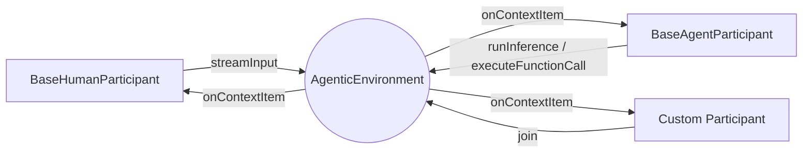

# Mozaik

**Mozaik** is an open-source TypeScript framework for building reactive AI agents that share an **agentic environment** instead of being orchestrated through rigid workflows.

  

In Mozaik, humans, agents, observers, and tools are all `Participant`s of the same `AgenticEnvironment`. Each participant runs **non-blocking** and streams typed `ContextItem`s into the environment. Every other participant sees those items in real time and can react, intercept, or stay silent — without any central scheduler.

---

## Installation

```bash
yarn add @mozaik-ai/core
```

## API Key Configuration

```env
# .env
OPENAI_API_KEY=your-openai-key-here
```

---

## The agentic environment

`AgenticEnvironment` is a broadcast bus for typed context items. `Participant`s `join()` it, and any item produced by one participant is delivered to every subscriber's `onContextItem(source, item)` callback.



---

## Non-blocking participants

Mozaik ships two ready-to-use participants:

| Participant            | Capabilities                                              | Pulls from                                                 |
| ---------------------- | --------------------------------------------------------- | ---------------------------------------------------------- |
| `BaseHumanParticipant` | `InputCapable`                                            | `InputItemSource`                                          |
| `BaseAgentParticipant` | `InputCapable`, `InferenceCapable`, `FunctionCallCapable` | `InputItemSource`, `InferenceRunner`, `FunctionCallRunner` |

Each capability method is **non-blocking**: it returns `Promise<void>`, and as the underlying generator yields items they are streamed into the environment one-by-one through the `deliverStream` helper:

```5:14:src/application/deliver-stream.ts
export async function deliverStream<T extends ContextItem>(
    environment: AgenticEnvironment,
    initiator: Participant,
    stream: AsyncIterable<T>,
  ): Promise<void> {

    for await (const item of stream) {
        await environment.deliverContextItem(initiator, item);
    }
}
```

Because each call is a fresh promise that wraps an async iterable, multiple participants can act on the same environment **concurrently**:

```ts
import {
	AgenticEnvironment,
	BaseAgentParticipant,
	BaseHumanParticipant,
	Gpt54Mini,
	ModelContext,
} from "@mozaik-ai/core"

const environment = new AgenticEnvironment()

const human = new BaseHumanParticipant(humanInputSource)
const agent = new BaseAgentParticipant(agentInputSource, inferenceRunner, functionCallRunner)

human.join(environment)
agent.join(environment)

environment.start()

const context = ModelContext.create("demo")
const model = new Gpt54Mini()

// Both participants produce items in parallel — neither awaits the other.
human.streamInput(environment)
agent.runInference(environment, context, model)
```

The environment fans every item out to every subscriber synchronously and without awaiting them, so a slow listener never blocks producers or other listeners.

---

## Intercepting items from other participants

`onContextItem(source, item)` is the single intercept point. A participant can:

- **Observe** items from other participants (telemetry, audit, UI streaming).
- **React** to items by triggering its own capabilities (turn a `UserMessageItem` into an inference run, turn a `FunctionCallItem` into a tool execution).
- **Ignore** items it doesn't care about — it is just a method call.

Items are discriminated by the `ContextItem` subclass and, for messages, the `role` field. The full taxonomy is in [src/domain/model-context/context-item](src/domain/model-context/context-item):

- Client-produced: `UserMessageItem`, `DeveloperMessageItem`, `SystemMessageItem`, `FunctionCallOutputItem`
- Model-produced: `ModelMessageItem`, `FunctionCallItem`, `ReasoningItem`

### Passive observer

```ts
import { Participant, ContextItem } from "@mozaik-ai/core"

export class TranscriptLogger extends Participant {
	async onContextItem(source: Participant, item: ContextItem): Promise<void> {
		console.log(`[${source.constructor.name}]`, item.toJSON())
	}
}
```

### Reactive agent

A reactive agent extends `BaseAgentParticipant` and uses incoming items from _other_ participants to decide when to run inference or execute a tool call:

```ts
import {
	BaseAgentParticipant,
	Participant,
	ContextItem,
	UserMessageItem,
	FunctionCallItem,
	AgenticEnvironment,
	ModelContext,
	GenerativeModel,
	InputItemSource,
	InferenceRunner,
	FunctionCallRunner,
} from "@mozaik-ai/core"

export class ReactiveAgent extends BaseAgentParticipant {
	constructor(
		inputSource: InputItemSource,
		inferenceRunner: InferenceRunner,
		functionCallRunner: FunctionCallRunner,
		private readonly environment: AgenticEnvironment,
		private readonly context: ModelContext,
		private readonly model: GenerativeModel,
	) {
		super(inputSource, inferenceRunner, functionCallRunner)
	}

	async onContextItem(source: Participant, item: ContextItem): Promise<void> {
		if (source === this) return

		this.context.addContextItem(item)

		if (item instanceof UserMessageItem) {
			this.runInference(this.environment, this.context, this.model)
			return
		}

		if (item instanceof FunctionCallItem) {
			this.executeFunctionCall(this.environment, item)
			return
		}
	}
}
```

Two things to note:

1. The agent never `await`s its own capability calls inside `onContextItem` — the methods are non-blocking, so the environment keeps delivering items while inference and tool execution run in the background.
2. Behaviors compose by **reaction**, not orchestration. Add a second agent that listens for `ModelMessageItem`s and you get a critique loop. Add a `TranscriptLogger` and you get a UI stream. Neither change touches the existing participants.

---

## Context and models (reference)

`ModelContext` is the ordered list of `ContextItem`s a `GenerativeModel` is asked to reason over. It is constructed and mutated explicitly — typically inside a participant in response to delivered items.

```ts
import { ModelContext, DeveloperMessageItem, UserMessageItem, InMemoryModelContextRepository } from "@mozaik-ai/core"

const context = ModelContext.create("project-id")
	.addContextItem(DeveloperMessageItem.create("You are a helpful assistant."))
	.addContextItem(UserMessageItem.create("What is the capital of France?"))

const repo = new InMemoryModelContextRepository()
await repo.save(context)
```

Implement `ModelContextRepository` to plug in any storage backend.

The default OpenAI provider is `OpenAIResponses`, implementing the [OpenResponses](https://www.openresponses.org/) spec. It maps `ModelContext` to the OpenAI Responses API and back into typed `ContextItem`s. Bundled models: `Gpt54`, `Gpt54Mini`, `Gpt54Nano`.

```ts
import { OpenAIResponses, InferenceRequest, Gpt54 } from "@mozaik-ai/core"

const runtime = new OpenAIResponses()
const response = await runtime.infer(new InferenceRequest(new Gpt54(), context))
```

---

## Advanced: overriding generators

`BaseAgentParticipant` and `BaseHumanParticipant` are deliberately thin shells around three generator interfaces. Swap any of them to change _how_ items are produced without touching the environment, the participants, or any consumers.

### Custom `InputItemSource`

```ts
import { InputItemSource, UserMessageItem, DeveloperMessageItem, SystemMessageItem } from "@mozaik-ai/core"

type InputItem = UserMessageItem | DeveloperMessageItem | SystemMessageItem

export class QueueInputSource implements InputItemSource {
	private readonly queue: InputItem[] = []
	private resolveNext?: () => void

	push(item: InputItem) {
		this.queue.push(item)
		this.resolveNext?.()
		this.resolveNext = undefined
	}

	async *stream(signal?: AbortSignal): AsyncIterable<InputItem> {
		while (!signal?.aborted) {
			while (this.queue.length > 0) {
				yield this.queue.shift()!
			}
			await new Promise<void>((resolve) => (this.resolveNext = resolve))
		}
	}
}
```

Use it for stdin, websockets, an HTTP queue, or anything that produces user/developer/system messages over time.

### Custom `InferenceRunner`

Wrap any model runtime — including `OpenAIResponses` — and decide how its output becomes a stream of items. Here we expand a single `InferenceResponse` into per-item delivery:

```ts
import {
	InferenceRunner,
	InferenceRequest,
	ModelContext,
	GenerativeModel,
	OpenAIResponses,
	ReasoningItem,
	FunctionCallItem,
	ModelMessageItem,
} from "@mozaik-ai/core"

type InferenceItem = ReasoningItem | FunctionCallItem | ModelMessageItem

export class OpenAIInferenceRunner implements InferenceRunner {
	private readonly runtime = new OpenAIResponses()

	async *run(context: ModelContext, model: GenerativeModel, signal?: AbortSignal): AsyncIterable<InferenceItem> {
		const response = await this.runtime.infer(new InferenceRequest(model, context))
		for (const item of response.contextItems) {
			yield item as InferenceItem
		}
	}
}
```

Replace the body with a streaming runtime and items will flow into the environment as soon as the model produces them.

### Custom `FunctionCallRunner`

Resolve a `FunctionCallItem` against a tool registry and yield its output:

```ts
import { FunctionCallRunner, FunctionCallItem, FunctionCallOutputItem, Tool } from "@mozaik-ai/core"

export class ToolRegistryFunctionCallRunner implements FunctionCallRunner {
	constructor(private readonly tools: Tool[]) {}

	async *run(call: FunctionCallItem, signal?: AbortSignal): AsyncIterable<FunctionCallOutputItem> {
		const tool = this.tools.find((t) => t.name === call.name)
		if (!tool) throw new Error(`Unknown tool: ${call.name}`)

		const result = await tool.invoke(JSON.parse(call.args))
		yield FunctionCallOutputItem.create(call.callId, JSON.stringify(result))
	}
}
```

### Wiring it together

```ts
import { BaseAgentParticipant, AgenticEnvironment } from "@mozaik-ai/core"

const agent = new BaseAgentParticipant(
	new QueueInputSource(),
	new OpenAIInferenceRunner(),
	new ToolRegistryFunctionCallRunner(tools),
)

agent.join(new AgenticEnvironment())
```

You now own input, inference, and tool execution end-to-end while keeping the same `Participant` contract — and any other participant in the environment can still observe and react to everything the agent emits.

---

## Author & License

Created by the [JigJoy](https://jigjoy.io) team.  
Licensed under the MIT License.
