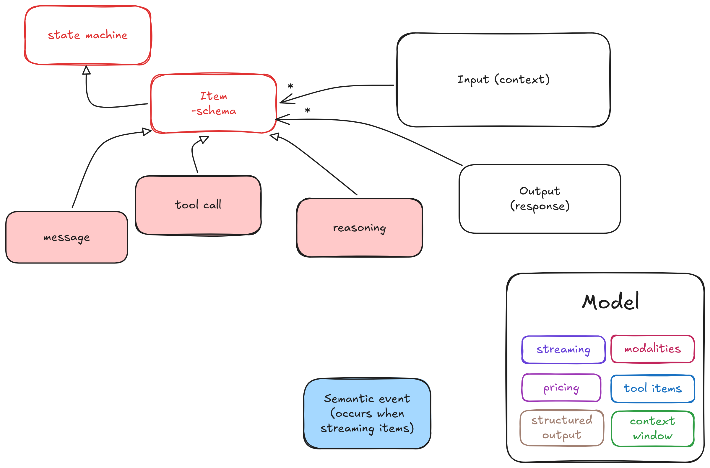

# Mozaik

Mozaik is a TypeScript library for orchestrating AI agents.


---

## 📦 Installation

```bash
yarn add @mozaik-ai/core
```

## API Key Configuration

Make sure to set your API keys in a `.env` file at the root of your project:

```env
# For OpenAI
OPENAI_API_KEY=your-openai-key-here
```

## Context Runtime (Overview)

The **Context Runtime** models the core behavior of a language model:

> Given a structured **context**, produce a **response**.

It abstracts away vendor-specific APIs (e.g. OpenAI) and provides a domain-centric interface for working with LLMs.

---

## Compatibility

This domain model is fully compatible with the **Open Responses** specification for multi-provider LLM interfaces ([openresponses.org](https://www.openresponses.org/)).



The core idea of OpenResponses is a **unified specification across LLM providers**: while vendors differ in details, most models follow the same interaction architecture and principles. OpenResponses standardizes that shared shape using **typed context items** (and clarifies that any item type can be streamed).

- **Input (context)**: client-provided context items such as **user_message**, **developer_message**, and **function_call_output**
- **Output (response)**: model-produced context items such as **reasoning**, **function_call**, and **model_message**
- **Streaming (optional)**: items may be delivered incrementally as **semantic events** (meaningful events at the item level, not just raw token streams)

## Core Concepts

### Context

Represents everything the model needs to generate a response.

A context is composed of ordered **context items**.

---

### ContextItem

A single unit of context.

Examples:

- Client-specific
    - User message
    - Developer message (System instruction)
    - Function call output (added after a model function call and fed back so the model can continue reasoning or finish the job)
- Model-specific
    - Function call
    - Model message
    - Reasoning

---

## Example (Context + OpenAI Responses)

This is a minimal end-to-end example that:

- builds a `Context` from a developer message + user message
- calls a model (OpenAI Responses API)
- stores/restores the context using a repository

```ts
const contextRepository = new InMemoryContextRepository()

const message = UserMessage.create("Tell me a joke about birds")
const developerMessage = DeveloperMessage.create(
	"You are a joke teller. You will be given a joke and you will need to tell it to the user.",
)
const projectId = `pr-${crypto.randomUUID()}`
const context = Context.create(projectId).addItem(developerMessage).addItem(message)

await contextRepository.save(context)

const model = new GPT54Model()
const newContextItems = await model.call(context)
context.addItems(newContextItems)

await contextRepository.save(context)
const restoredContexts = await contextRepository.getByProjectId(projectId)
console.log(restoredContexts)
```

## Author & License

Created by [JigJoy](https://jigjoy.io) team
Licensed under the MIT License.
