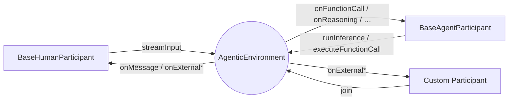

# Mozaik

**Mozaik** is TypeScript framework for building reactive agents. It provides the easiest way to build collaborative, **event-driven agents** that can work together in parallel.

  

In Mozaik, humans, agents, observers, and tools are all `Participant`s of the same `AgenticEnvironment`. Each participant runs **non-blocking** and produces events into the environment: plain-text **messages** for conversational input/output, and typed `ContextItem`s for model internals (function calls, function call outputs, reasoning, model messages). Every other participant sees those events in real time and can react, intercept, or stay silent — without any central scheduler.

---

## Installation

```bash
yarn add @mozaik-ai/core
```

## API Key Configuration

```env
# .env
OPENAI_API_KEY=your-openai-key-here
```

---

## The agentic environment

`AgenticEnvironment` is where everything happens. `Participant`s `join()` it, and from that moment on they can **listen to messages and events** flowing through the environment by overriding any of the handlers below:

| Handler                        | Triggered when…                                              |
| ------------------------------ | ------------------------------------------------------------ |
| `onMessage`                    | any participant sends a message                              |
| `onFunctionCall`               | its own inference returns a function call                    |
| `onExternalFunctionCall`       | another agent's inference returns a function call            |
| `onFunctionCallOutput`         | its own function call runner returns a result                |
| `onExternalFunctionCallOutput` | another agent's function call runner returns a result        |
| `onReasoning`                  | its own inference returns a reasoning item                   |
| `onExternalReasoning`          | another agent's inference returns a reasoning item           |
| `onModelMessage`               | its own inference returns an assistant message               |
| `onExternalModelMessage`       | another agent's inference returns an assistant message       |

Every handler defaults to a no-op — override only the ones you care about.



---

## Agent Loop Implementation

The easiest way to build **and control** an agent loop is to override three handlers on `BaseAgentParticipant`:

````ts

export class CustomAgent extends BaseAgentParticipant {

	constructor(
		inputSource: InputStream,
		inferenceRunner: InferenceRunner,
		functionCallRunner: FunctionCallRunner,
		private readonly environment: AgenticEnvironment,
		private readonly context: ModelContext,
		private readonly model: GenerativeModel,
	) {
		super(inputSource, inferenceRunner, functionCallRunner)
	}

	async onMessage(message: string): Promise<void> {
		this.context.addContextItem(UserMessageItem.create(message))
		this.runInference(this.environment, this.context, this.model)
	}

	async onFunctionCall(item: FunctionCallItem): Promise<void> {
		this.context.addContextItem(item)
		this.executeFunctionCall(this.environment, item)
	}

	async onFunctionCallOutput(item: FunctionCallOutputItem): Promise<void> {
		this.context.addContextItem(item)
		this.runInference(this.environment, this.context, this.model)
	}
}
````
---

## Non-blocking participants

Mozaik ships two ready-to-use participants:

| Participant            | Capabilities                                              | Pulls from                                             |
| ---------------------- | --------------------------------------------------------- | ------------------------------------------------------ |
| `BaseHumanParticipant` | `InputCapable`                                            | `InputStream`                                          |
| `BaseAgentParticipant` | `InputCapable`, `InferenceCapable`, `FunctionCallCapable` | `InputStream`, `InferenceRunner`, `FunctionCallRunner` |

```ts
import {
	AgenticEnvironment,
	BaseAgentParticipant,
	BaseHumanParticipant,
	Gpt54Mini,
	ModelContext,
} from "@mozaik-ai/core"

const environment = new AgenticEnvironment()

const human = new BaseHumanParticipant(humanInputSource)
const agent = new BaseAgentParticipant(agentInputSource, inferenceRunner, functionCallRunner)

human.join(environment)
agent.join(environment)

environment.start()

const context = ModelContext.create("demo")
const model = new Gpt54Mini()

// Both participants produce items in parallel — neither awaits the other.
human.streamInput(environment)
agent.runInference(environment, context, model)
````

The environment fans every item out to every subscriber synchronously and without awaiting them, so a slow listener never blocks producers or other listeners.

---

## Intercepting events from other participants

Instead of a single catch-all callback, `Participant` exposes **one typed handler per event kind**, with a clear split between events the participant emitted itself and events emitted by someone else. A participant can:

- **Observe** events from other participants via the `onExternal*` family (telemetry, audit, UI streaming) and `onMessage` for plain-text messages.
- **React** to its own outputs via the self handlers (e.g. execute a `FunctionCallItem` it just produced), or to others' outputs via the external handlers.
- **Ignore** events it doesn't care about — every handler defaults to a no-op in the bundled participants.

The typed `ContextItem`s involved are defined in [src/domain/model-context/context-item](src/domain/model-context/context-item):

- Client-produced: `FunctionCallOutputItem` (and `UserMessageItem` / `DeveloperMessageItem` / `SystemMessageItem` when building a `ModelContext` directly)
- Model-produced: `ModelMessageItem`, `FunctionCallItem`, `ReasoningItem`

Plain conversational input flows as a `string` through `onMessage` — participants exchange messages without committing to a specific `ContextItem` shape on the wire.

### Passive observer

A passive observer subclasses `Participant` and overrides only the handlers it cares about:

```ts
import { Participant, FunctionCallItem, FunctionCallOutputItem, ReasoningItem, ModelMessageItem } from "@mozaik-ai/core"

export class TranscriptLogger extends Participant {
	async onMessage(message: string): Promise<void> {
		console.log("[message]", message)
	}

	async onExternalFunctionCall(source: Participant, item: FunctionCallItem): Promise<void> {
		console.log(`[${source.constructor.name}] function_call`, item.toJSON())
	}

	async onExternalFunctionCallOutput(source: Participant, item: FunctionCallOutputItem): Promise<void> {
		console.log(`[${source.constructor.name}] function_call_output`, item.toJSON())
	}

	async onExternalReasoning(source: Participant, item: ReasoningItem): Promise<void> {
		console.log(`[${source.constructor.name}] reasoning`, item.toJSON())
	}

	async onExternalModelMessage(source: Participant, item: ModelMessageItem): Promise<void> {
		console.log(`[${source.constructor.name}] model_message`, item.toJSON())
	}

	// Self-emitted handlers (onFunctionCall, onReasoning, …) can be no-ops for a pure observer.
	async onFunctionCall(): Promise<void> {}
	async onFunctionCallOutput(): Promise<void> {}
	async onReasoning(): Promise<void> {}
	async onModelMessage(): Promise<void> {}
}
```

### Reactive agent

A reactive agent extends `BaseAgentParticipant` and overrides the handlers it wants to react on. Each handler is already a no-op in the base class, so only the relevant ones need bodies:

```ts
import {
	BaseAgentParticipant,
	Participant,
	UserMessageItem,
	FunctionCallItem,
	AgenticEnvironment,
	ModelContext,
	GenerativeModel,
	InputStream,
	InferenceRunner,
	FunctionCallRunner,
} from "@mozaik-ai/core"

export class ReactiveAgent extends BaseAgentParticipant {
	constructor(
		inputSource: InputStream,
		inferenceRunner: InferenceRunner,
		functionCallRunner: FunctionCallRunner,
		private readonly environment: AgenticEnvironment,
		private readonly context: ModelContext,
		private readonly model: GenerativeModel,
	) {
		super(inputSource, inferenceRunner, functionCallRunner)
	}

	// A message from a human (or any other participant) → record it and think.
	async onMessage(message: string): Promise<void> {
		this.context.addContextItem(UserMessageItem.create(message))
		this.runInference(this.environment, this.context, this.model)
	}

	// The agent just produced a function call → execute it.
	async onFunctionCall(item: FunctionCallItem): Promise<void> {
		this.context.addContextItem(item)
		this.executeFunctionCall(this.environment, item)
	}

	// The tool just produced an output → feed it back and run inference again.
	async onFunctionCallOutput(item: FunctionCallOutputItem): Promise<void> {
		this.context.addContextItem(item)
		this.runInference(this.environment, this.context, this.model)
	}

	// Keep the local context in sync with model-emitted reasoning and replies.
	async onReasoning(item: ReasoningItem): Promise<void> {
		this.context.addContextItem(item)
	}

	async onModelMessage(item: ModelMessageItem): Promise<void> {
		this.context.addContextItem(item)
	}
}
```

Three things to note:

1. The split between self handlers and `onExternal*` handlers means a participant can encode "act on my own outputs" separately from "observe others", without inspecting `source` by hand.
2. The agent never `await`s its own capability calls inside the handlers — those methods are non-blocking, so the environment keeps delivering events while inference and tool execution run in the background.
3. Behaviors compose by **reaction**, not orchestration. Add a second agent that overrides `onExternalModelMessage` and you get a critique loop. Add a `TranscriptLogger` and you get a UI stream. Neither change touches the existing participants.

---

## Context and models (reference)

`ModelContext` is the ordered list of `ContextItem`s a `GenerativeModel` is asked to reason over. It is constructed and mutated explicitly — typically inside a participant in response to delivered items.

```ts
import { ModelContext, DeveloperMessageItem, UserMessageItem, InMemoryModelContextRepository } from "@mozaik-ai/core"

const context = ModelContext.create("project-id")
	.addContextItem(DeveloperMessageItem.create("You are a helpful assistant."))
	.addContextItem(UserMessageItem.create("What is the capital of France?"))

const repo = new InMemoryModelContextRepository()
await repo.save(context)
```

Implement `ModelContextRepository` to plug in any storage backend.

The default OpenAI provider is `OpenAIResponses`, implementing the [OpenResponses](https://www.openresponses.org/) spec. It maps `ModelContext` to the OpenAI Responses API and back into typed `ContextItem`s. Bundled models: `Gpt54`, `Gpt54Mini`, `Gpt54Nano`, `Gpt55`.

```ts
import { OpenAIResponses, InferenceRequest, Gpt54 } from "@mozaik-ai/core"

const runtime = new OpenAIResponses()
const response = await runtime.infer(new InferenceRequest(new Gpt54(), context))
```

---

## Advanced: overriding generators

`BaseAgentParticipant` and `BaseHumanParticipant` are deliberately thin shells around three generator interfaces. Swap any of them to change _how_ events are produced without touching the environment, the participants, or any consumers.

### Custom `InputStream`

An `InputStream` is the minimal text-source contract a participant uses to feed messages into the environment:

```ts
export interface InputStream {
	stream(signal?: AbortSignal): AsyncIterable<string>
}
```

Each yielded string is delivered to every other participant through `onMessage(message: string)`. This keeps the wire format dead simple: participants exchange text, and each one decides how to turn that text into a `ContextItem` for its own `ModelContext`.

```ts
import { InputStream } from "@mozaik-ai/core"

export class QueueInputStream implements InputStream {
	private readonly queue: string[] = []
	private resolveNext?: () => void

	push(message: string) {
		this.queue.push(message)
		this.resolveNext?.()
		this.resolveNext = undefined
	}

	async *stream(signal?: AbortSignal): AsyncIterable<string> {
		while (!signal?.aborted) {
			while (this.queue.length > 0) {
				yield this.queue.shift()!
			}
			await new Promise<void>((resolve) => (this.resolveNext = resolve))
		}
	}
}
```

Use it for stdin, websockets, an HTTP queue, or anything that produces text over time. A reactive agent typically wraps the incoming string in a `UserMessageItem` inside `onMessage` before adding it to its `ModelContext` — see the [Reactive agent](#reactive-agent) example above.

### Custom `InferenceRunner`

Wrap any model runtime — including `OpenAIResponses` — and decide how its output becomes a stream of items. Here we expand a single `InferenceResponse` into per-item delivery:

```ts
import {
	InferenceRunner,
	InferenceRequest,
	ModelContext,
	GenerativeModel,
	OpenAIResponses,
	ReasoningItem,
	FunctionCallItem,
	ModelMessageItem,
} from "@mozaik-ai/core"

type InferenceItem = ReasoningItem | FunctionCallItem | ModelMessageItem

export class OpenAIInferenceRunner implements InferenceRunner {
	private readonly runtime = new OpenAIResponses()

	async *run(context: ModelContext, model: GenerativeModel, signal?: AbortSignal): AsyncIterable<InferenceItem> {
		const response = await this.runtime.infer(new InferenceRequest(model, context))
		for (const item of response.contextItems) {
			yield item as InferenceItem
		}
	}
}
```

Replace the body with a streaming runtime and items will flow into the environment as soon as the model produces them.

### Custom `FunctionCallRunner`

Resolve a `FunctionCallItem` against a tool registry and yield its output:

```ts
import { FunctionCallRunner, FunctionCallItem, FunctionCallOutputItem, Tool } from "@mozaik-ai/core"

export class ToolRegistryFunctionCallRunner implements FunctionCallRunner {
	constructor(private readonly tools: Tool[]) {}

	async *run(call: FunctionCallItem, signal?: AbortSignal): AsyncIterable<FunctionCallOutputItem> {
		const tool = this.tools.find((t) => t.name === call.name)
		if (!tool) throw new Error(`Unknown tool: ${call.name}`)

		const result = await tool.invoke(JSON.parse(call.args))
		yield FunctionCallOutputItem.create(call.callId, JSON.stringify(result))
	}
}
```

### Wiring it together

```ts
import { BaseAgentParticipant, AgenticEnvironment } from "@mozaik-ai/core"

const agent = new BaseAgentParticipant(
	new QueueInputStream(),
	new OpenAIInferenceRunner(),
	new ToolRegistryFunctionCallRunner(tools),
)

agent.join(new AgenticEnvironment())
```

You now own input, inference, and tool execution end-to-end while keeping the same `Participant` contract — and any other participant in the environment can still observe and react to everything the agent emits.

---

## Made with Mozaik

- **[baro](https://github.com/Lotus015/baro)** — a Claude agent orchestrator where ten specialized participants (planner, executors, reviewer, fixer, librarian, auditor, and more) work fully concurrently on the same goal, like a team collaborating in real time instead of a single agent doing everything alone.

---

## Author & License

Created by the [JigJoy](https://jigjoy.io) team.  
Licensed under the MIT License.
